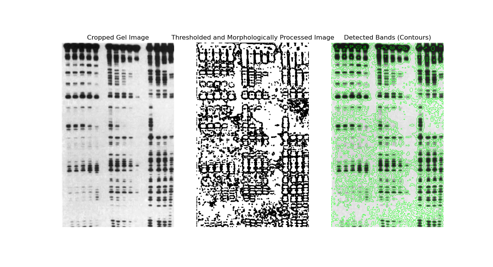
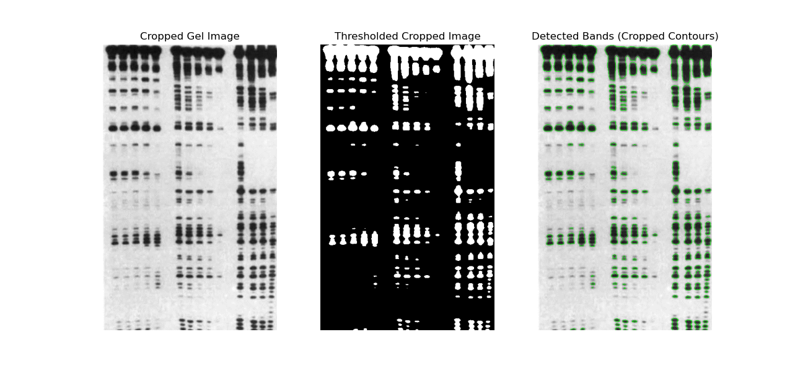

# BlotAnalysisTools

BlotAnalysisTools is a Python-based tool for analyzing gel and blot images commonly used in molecular biology and biochemistry research. It supports multiple analysis types, including **Western Blots**, **Northern Blots**, and **DNase Footprinting**, with customizable parameters and structured outputs for easy interpretation.


---

## Features

- **Western Blot Analysis**:
  - Detect protein bands.
  - Annotate lanes and generate band metadata.
  
- **Northern Blot Analysis**:
  - Identify RNA bands for gene expression studies.
  - Generate annotated images and export band data.

- **DNase Footprinting Analysis**:
  - Analyze protein-DNA interactions by detecting protected regions.
  - High-resolution band detection for closely spaced bands.

- **Generic Pipeline**:
  - Customizable pipeline for any gel or blot image with user-defined parameters.

---

## Installation

1. Clone the repository:
   ```bash
   git clone https://github.com/secondbook5/BlotAnalysisTools.git
   cd BlotAnalysisTools
   ```

2. Install dependencies:
   ```bash
   pip install -r requirements.txt
   ```

---

## Usage

### Command-Line Interface (CLI)

Run `main.py` with the following options:

- `--type`: Specify the analysis type (`western`, `northern`, `footprinting`, or `generic`).
- `--input`: Path to the input gel or blot image.
- `--output`: Directory to save the output results.
- `--visualize`: (Optional) Visualize lane detection during analysis.

#### Examples

1. **Western Blot Analysis**:
   ```bash
   python main.py --type western --input input/western_blot.png --output output/western_blot_analysis
   ```

2. **Northern Blot Analysis**:
   ```bash
   python main.py --type northern --input input/northern_blot.png --output output/northern_blot_analysis
   ```

3. **DNase Footprinting Analysis**:
   ```bash
   python main.py --type footprinting --input input/dnase_footprinting.png --output output/dnase_footprinting_analysis
   ```

4. **Generic Pipeline**:
   ```bash
   python main.py --type generic --input input/generic_blot.png --output output/generic_analysis
   ```

---

## Output

1. **Annotated Lanes**:
   - Images of individual lanes with detected bands highlighted.

2. **Metadata File**:
   - A CSV file summarizing the detected bands:
     ```
     lane_index,x,y,width,height,area,intensity
     1,10,20,15,25,375,128.5
     1,50,70,12,18,216,140.2
     ```

3. **Visualization (Optional)**:
   - Displays lane detection for debugging and validation.
   

---

## Project Structure

```
BlotAnalysisTools/
├── main.py                # Entry point with CLI
├── lane_detector.py       # Detect lanes in gel images
├── lane_extractor.py      # Extract cropped lanes from detected regions
├── band_detector.py       # Detect and annotate bands within lanes
├── analysis_types/        # Analysis-specific modules
│   ├── western.py         # Western blot analysis
│   ├── northern.py        # Northern blot analysis
│   ├── footprinting.py    # DNase footprinting analysis
│   └── __init__.py        # Package initialization
├── utils/                 # Shared utilities
│   ├── file_utils.py      # File input/output helpers
│   ├── visualization.py   # Visualization helpers
│   └── data_export.py     # Export-related utilities (e.g., CSV/JSON)
├── input/                 # Input images (example directory)
├── output/                # Output results (e.g., annotated images, metadata)
└── requirements.txt       # Python dependencies
```

---

## Dependencies

- Python 3.8+
- OpenCV (`cv2`)
- NumPy
- Pandas
- Matplotlib

Install all dependencies with:
```bash
pip install -r requirements.txt
```

---

## Development

### Add New Analysis Types

1. Create a new file in the `analysis_types/` directory (e.g., `southern.py`).
2. Implement a class for the new analysis type, similar to `WesternBlotAnalysis`.
3. Update `main.py` to include the new analysis type.

---

## Contributing

Contributions are welcome! To contribute:

1. Fork the repository.
2. Create a new branch for your feature or bugfix.
3. Submit a pull request with a detailed description.

---


## Acknowledgments

- **OpenCV**: For image processing.
- **NumPy** and **Pandas**: For numerical and data handling.
- **Matplotlib**: For visualization.

---
